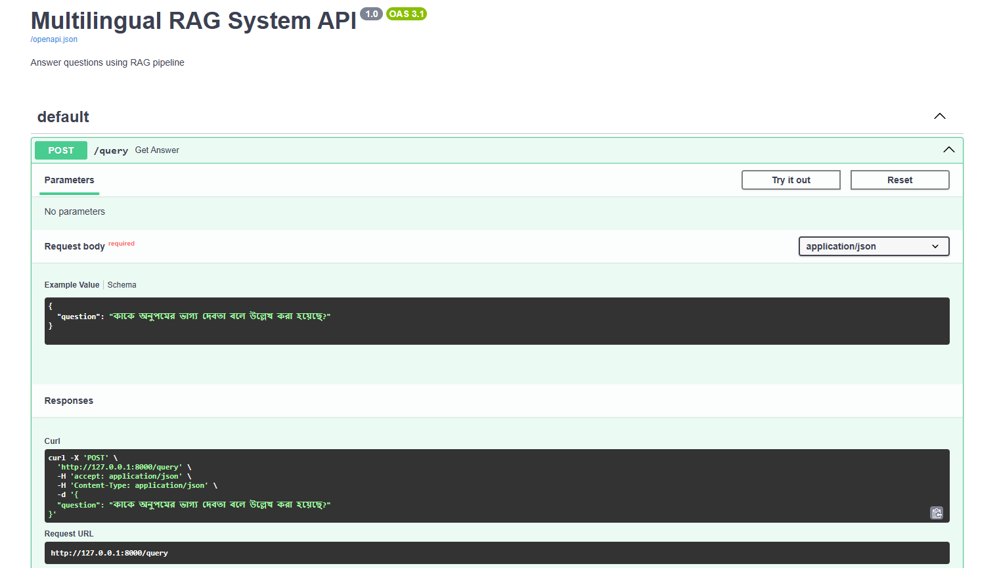

# Multilingual RAG System

This project is a Retrieval-Augmented Generation (RAG) system built to answer questions from knowledge-base, specifically HSC Bangla 1st Paper PDF. It supports both Bangla and English queries and uses semantic similarity search combined with LLM (Gemini) for generating context-based answers.

# Setup Guide:

* **Step 1: Clone the repository**  
    git clone https://github.com/NafisaKhan/Multilingual-RAG-System.git
* **Step 2: Navigate into the project directory**
    cd Multilingual-RAG-System
* **Step 3: Create a virtual environment**
    python -m venv venv
* **Step 4: Activate the virtual environment on Windows**
    venv\Scripts\activate
* **Step 5: Install required packages**
    pip install -r requirements.txt
* **Step 6: Create a .env file with your Gemini API key and add the line:**
    GEMINI_API_KEY=your-gemini-api-key-here
* **Step 7: Run the main file (entry-point)**
    python main.py
* **Step 8: Start the FastAPI server**
    uvicorn api:app --reload
* **Step 9: Open the frontend in Streamlit UI**
    streamlit run app.py

# Used Tools, Libraries, and Packages:

* FastAPI: Used in api.py to create backend endpoints for question answering.
* Streamlit: Used in app.py to build a simple user interface for querying the system.
* google-generativeai: Used in answer_generation.py to call Gemini API for final response generation.
* faiss-cpu: Used in vector_embedding.py for indexing and performing similarity search on embedded chunks.
* langchain: Used throughout the embedding and retrieval flow via vector_embedding.py and chunk_retrieval.py.
* langchain-huggingface: Used to load the HuggingFace embedding model for multilingual vector generation.
* langchain-community, langchain-core, langchain-text-splitters: Required by Langchain modules used for FAISS and document handling.
* sentence-transformers: Used to provide the multilingual embedding model (distiluse-base-multilingual-cased-v1).
* pytesseract: Used in pdf_preprocessor.py to extract text from scanned PDF pages via OCR.
* pdf2image: Used in pdf_preprocessor.py to convert PDF pages to images for OCR.
* Pillow: Used to preprocess images (grayscale, thresholding) before OCR.
* python-dotenv: Used to load environment variables like API keys in multiple files (api.py, main.py, etc.).
* requests: Used in app.py to send POST requests from Streamlit to the FastAPI backend.
* pandas: Used in rag_evaluation.py to manage evaluation result storage and CSV export.
* regex: Used in text_chunking.py and pdf_preprocessor.py for pattern matching and cleanup.
* tqdm:Used in main.py to show progress during processing.
* numpy: Imported as a dependency for other libraries.

# Sample Queries and Outputs:
Sample generated answers and chat history are available in the 'outputs/' folder:

- [generated_answers.txt](outputs/generated_answers.txt) — Final answers generated by the system  
- [chat_history.txt](outputs/chat_history.txt) — Short-term memory of user–system conversations 

# API Documentation:

The FastAPI Swagger UI is available at http://127.0.0.1:8000/docs/ when the server is running. Click the "Try it out" button on the right, enter your question in the input box, and click "Execute" to see the answer.

Example:

# Evaluation Matrix:

The evaluation script compares generated answers against sample test cases using the following metrics.  
[View Evaluation Metrics Results](rag_tests/evaluation_results.csv)

- **Human Match**: Whether the generated answer exactly matches the expected answer  
- **Groundedness**: Whether the generated answer appears in the retrieved document chunks  
- **Relevance**: Whether the expected answer appears in the retrieved document chunks  
- **Cosine Similarity Score**: Similarity score from FAISS-based retrieval

# Assessment Question-Answers:

* **What method or library did you use to extract the text, and why? Did you face any formatting challenges with the PDF content?**  
I used pdf2image to convert PDF pages into images and then applied pytesseract to extract text using OCR. I also tested libraries like PyMuPDF (fitz) for direct text parsing, but OCR gave more accurate results, especially with Bangla text.  
Yes, I did face formatting challenges. The raw extracted text included broken sentences, repeated headers and footers, inconsistencies in MCQ formatting, and other noise. To handle these issues, I applied Unicode normalization and wrote custom regex patterns to clean and reformat the text.

* **What chunking strategy did you choose? Why do you think it works well for semantic retrieval?**  
I chose a hybrid chunking strategy (sentence-based chunking and pattern-based chunking) to handle both paragraph-style and MCQ-style content in the documents. For regular paragraph text, I used sentence boundaries along with a fixed character limit of 400 characters and a small overlap between chunks to preserve context continuity. For MCQs, I applied regex-based pattern detection to group the question and its four options into a single chunk.  
This strategy works well for semantic retrieval because it creates complete, meaningful chunks that maintain semantic structure, whether it's a paragraph or a MCQ. It's more effective because it improves the chances of matching the right text when someone asks a question.

* **What embedding model did you use? Why did you choose it? How does it capture the meaning of the text?**  
I used the distiluse-base-multilingual-cased-v1 model from Sentence Transformers, through Langchain’s HuggingFace integration. I chose it because it supports both Bangla and English, which is essential for this project.  
The model captures the meaning of the text by embedding semantically similar sentences into nearby positions in vector space. So even if the phrasing of a user query differs from the source text, the system can still retrieve relevant content.

* **How are you comparing the query with your stored chunks? Why did you choose this similarity method and storage setup?**  
I am using cosine similarity to compare the vector for the question with the vectors of all chunks. FAISS handles that comparison because it’s fast and can process large amounts of data efficiently. Each time a question comes in, it gets converted into a vector, and FAISS finds the top 3 most similar chunks. I pass those to the LLM (Gemini) to help generate the final answer. I chose this setup because it’s fast, scalable, and easy to integrate into the Langchain workflow.

* **How do you ensure meaningful comparison of questions and document chunks? What would happen if the query is vague or missing context?**  
To ensure meaningful comparison, I include both the retrieved document chunks and the recent chat history as part of the prompt sent to the Gemini model. This short-term memory gives the model extra context, which is especially helpful for follow-up or unclear questions. If the query is vague or lacks context, the system might return a generic reply or just say "No answer found". In that case, the user might need to rephrase the question to help the model understand it better.

* **Do the results seem relevant? If not, what might improve them?**  
In my experience, the results weren’t always reliable. While the retrieval system and prompt formatting were working, the Gemini model often responded with "No answer found", even when there were relevant chunks available. This could be due to OCR errors, poorly aligned chunks, or insufficient information being passed to the model.  
To improve results in the future, I’d focus on using a better OCR engine for Bangla, smarter chunking that separates MCQs from descriptive answers, and possibly a stronger model like GPT-4. More precise prompts and cleaner chunk structure would also help produce better responses.

